# 基于RT-Smart实现FOC云台控制系统并封装成micropython库与物体自动跟踪系统

## 2025 RT-Thread嵌入式大赛-软件赛道作品

## 项目背景及功能

大多数K230实现的FOC云台控制方案都是使用K230作为上位机，通过串口等通讯协议向其他STM32单片机发送控制信号，再由其他单片机驱动无刷电机。该方案可以省去STM32单片机作为控制电路，直接由K230作为FOC控制器。

并且K230上的FOC控制算法是在RT-Smart上实现，使用硬件定时器更新输出力矩，比只用micropython实现，实时性会更优异。

同时也将FOC驱动算法封装成了micropython的库，在micropython上可以直接调用，这样也有了micropython方便编写代码与调试的特性。我们可以使用micropython原先的一些官方的AI库配合上自定义的FOC库，实现诸如物体自动跟踪等功能。

<br/>

## 效果演示

在官方人脸识别的例程上，加上了电机控制，将识别出的位置作为闭环输入。

自动跟踪的速度很大程度和模型的效率有关，这个人脸识别大概40ms一帧，效果还算差强人意。

我也试过例程给的YOLO模型，大概120ms一帧，跟踪效果就会比较卡。后面我会去尝试一下更快的模型，稍后发出。


CanMV IDE帧缓冲区延迟还是比较高的，如果把脚本保存到K230离线跑的话，跟踪效果看起来会比帧缓冲区这里好。


## 外设使用情况概述

将K230的6路PWM全都用上作为电机控制

使用两路IIC用于获取编码器值

使用了硬件定时器0定时更新力矩

<br/>

## 硬件设计

K230刚好有6路PWM正好可以实现驱动FOC云台（两个FOC电机），但是在庐山派这个板子上引出的PWM引脚只有五根，所以我们得先对庐山派做点小改。

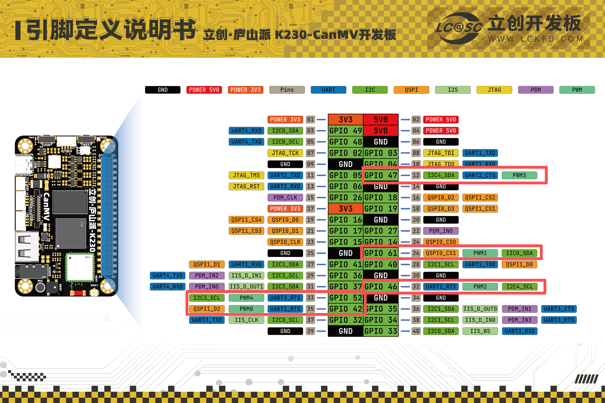

本来笔者看到只有5个PWM引脚引出都准备放弃由庐山派驱动两个电机的方案了，但是翻阅原理图发现非常幸运的是USR按钮的引脚是GPIO52正好可以作为PWM5的输出，而且这块位置也比较好焊接，焊好后也不影响原功能使用。

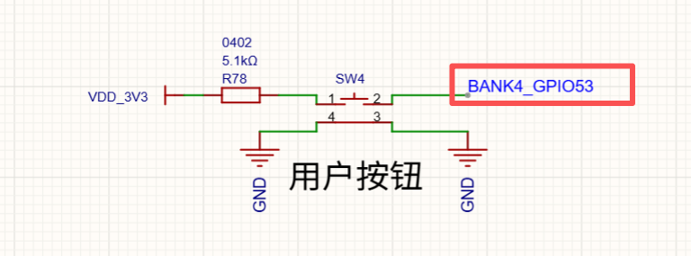

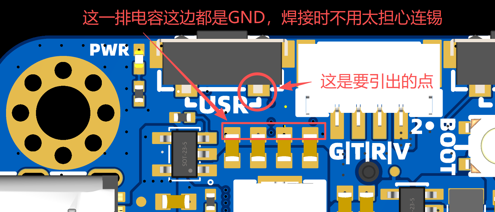

焊点比较小怕脱焊，可以打点热熔胶或绿油。

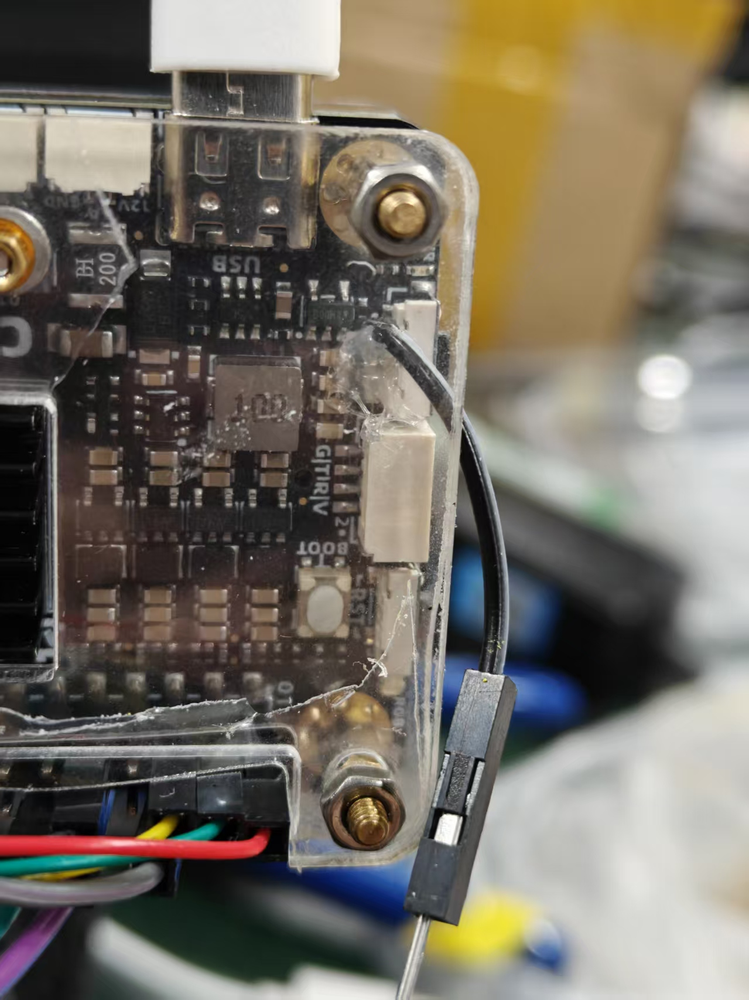

***

简单画了个板方便接线，这块板上面是MS8313芯片用来驱动电机，画的很潦草大神勿喷。

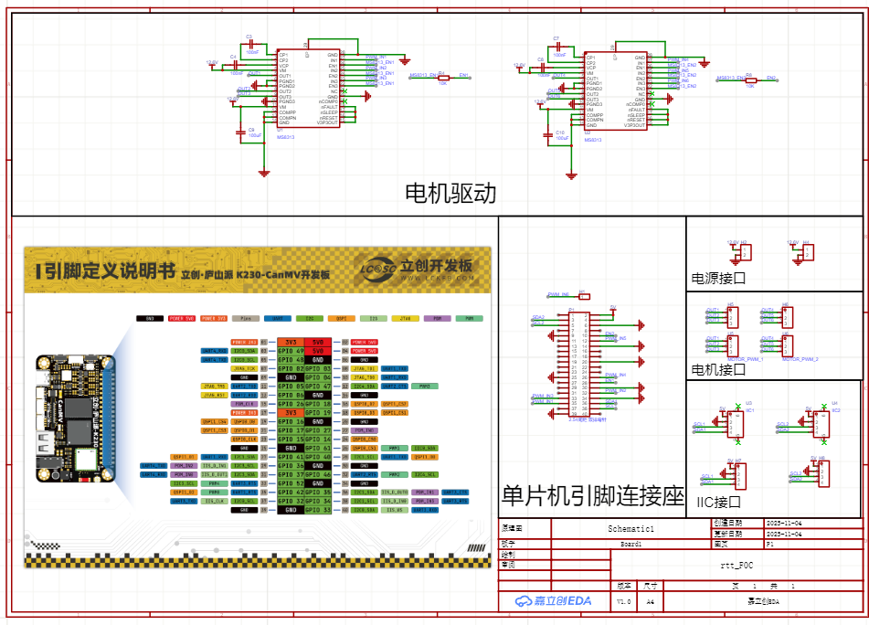

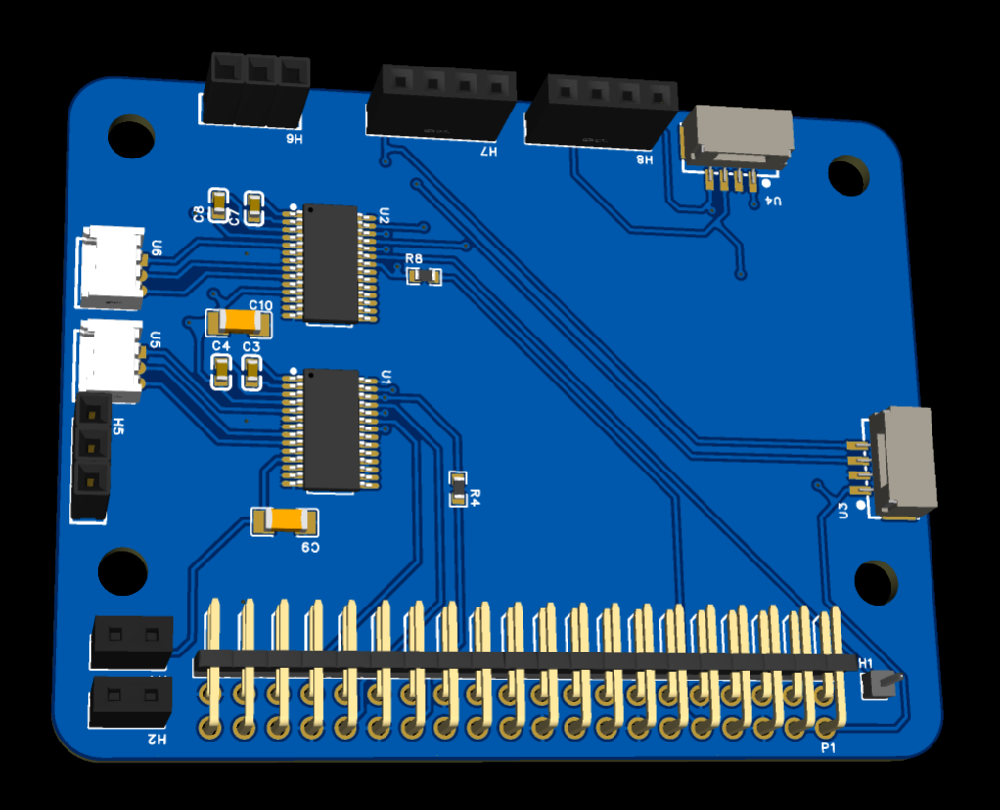

***

电机用的是常见的2804电机,使用MS8313芯片作为驱动，编码器是AS5600。下面这是FOC硬件框图。

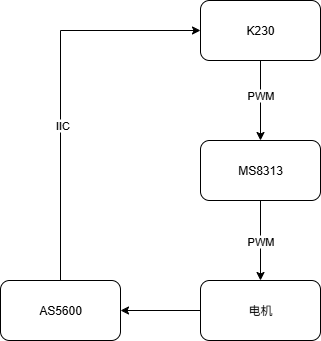

<br/>

装好后长这样，因为写这篇文章时电路板还没到，稍后测试完电路板会发上来，这里用的是杜邦线连接，所以看起来会比较乱。

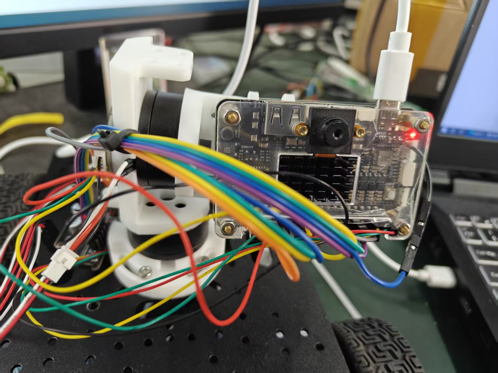

接线对应引脚：

```
云台Y轴电机编码器
IIC1_SCL → GPIO34
IIC1_SDA → GPIO35

云台X轴电机编码器
IIC0_SCL → GPIO48
IIC0_SDA → GPIO49

Y轴电机三路PWM
PWM0 → GPIO42
PWM2 → GPIO46
PWM4 → GPIO52
GPIO_OUTPUT → GPIO40 用作Y轴电机的EN引脚

X轴电机三路PWM
PWM1 → GPIO61
PWM3 → GPIO47
PWM5 → GPIO53
GPIO_OUTPUT → GPIO04 用作X轴电机的EN引脚

```

## 软件设计

下面是软件的总体框图，micropython其实就是跑在RT-Smart上的一个程序，对于芯片低层的一些驱动函数做了抽象，方便了我们开发。

但是micropython实时性和灵活性相对较低，并且K230上的micropython不支持硬件定时器。FOC控制对于实时性要求还是相对较高的，所以我选择了先用C实现FOC库，这样可以调用硬件定时器，保证了实时性。

<br/>

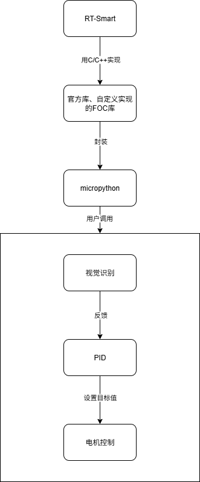

## 具体过程

1. **搭建CanMV K230开发环境**
   
   K230是一个有大小核的芯片，并且有四种开发环境，分别是CanMV、K230 RT-Smart Only、SDK Linux、SDKLinux+RT-Smart SDK。
   
   <br/>
   
   CanMV：大核跑RT-Smart，没有Linux，上电后自动运行micropython环境，可连CanMV IDE使用，RT-Smart串口调试接口是**Uart3**。
   
   K230 RT-Smart Only：大核跑RT-Smart，没有Linux，和CanMV的环境相比少了micropython。
   
   SDK Linux：大核跑Linux，没有RT-Smart，纯 Linux 进行开发。
   
   SDKLinux+RT-Smart SDK：大核跑RT-Smart，小核跑Linux，可以方便的使用RT-Smart做硬件操作，也有Linux的资源，但是镜像编译时长是最久的。
   
   <br/>
   
   这里因为我们要用到micropython所以要搭建CanMV的开发环境。
   
   可以参考下官方的CanMV SDK搭建过程[https://www.kendryte.com/k230_canmv/zh/main/zh/userguide/how_to_build.html](https://)
   
   这里我建议使用WSL Ubuntu20.04.06 LTS来搭建，编译调试都可以在Windows上解决非常方便。
   
   搭建完成后输入下在SDK根目录下执行`make list-def`可以看到SDK所有支持的开发板，我们选择带lckfb字样的。
   
   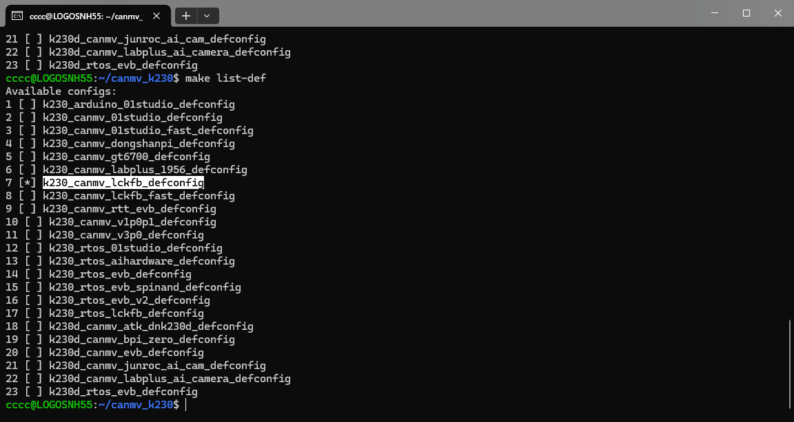
   
   然后输入`make  k230_canmv_lckfb_defconfig`就选择了庐山派作为编译目标。
   
   紧接着输入`make`就可以全局编译，如果是第一次搭建完环境一定要全局编译一次，不然后面局部编译是用不了的。
   
   如果遇到权限不足的情况，可以`chmod 777 文件夹`。输出`Build K230 done`就是编译成功
   
   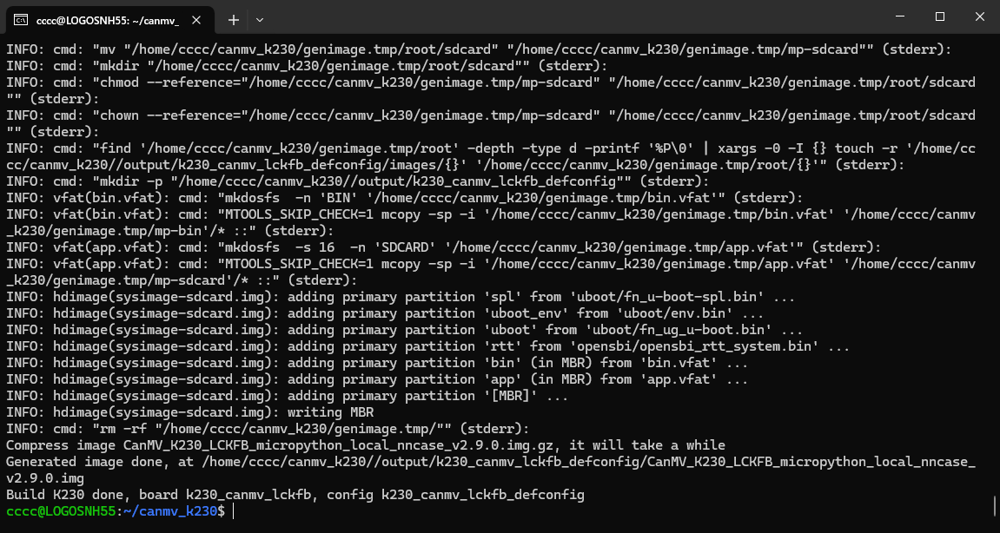
   
   这个开发环境有四个可供参考的库源码和例程文件夹
   
   RT-Smart用户态操作例程：`/canmv_k230/src/rtsmart/mpp/userapps/sample`
   
   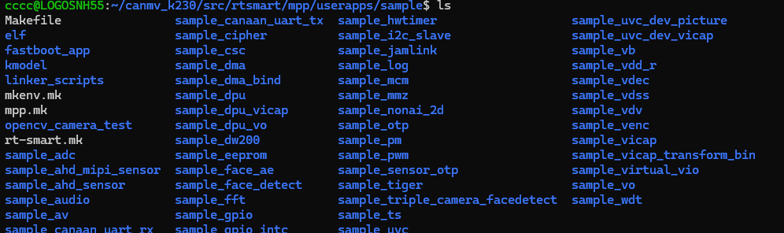
   
   Hal库源码：`/canmv_k230/src/rtsmart/libs/rtsmart_hal/drivers`
   
   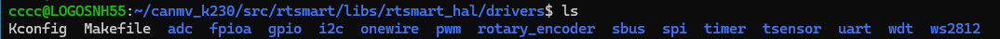
   
   Hal库例程：`/canmv_k230/src/rtsmart/libs/testcases/rtsmart_hal`
   
   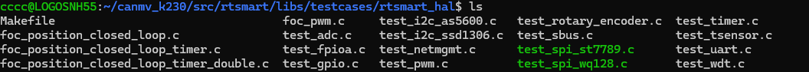
   
   micropython封装实现：`/canmv_k230/src/canmv/port`
   
   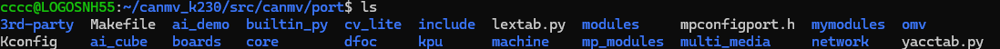
   
   如果要在RT-Smart上开发建议参考官方文档，和这些源码。这里我主要是用Hal库来实现。
   
   PS：这些例程不是针对庐山派这个开发板的，所以可能直接用没有效果，就比如用户态例程中的`sample_pwm`，如果我们要使用该例程输出pwm，必须参考`sample_gpio`重新绑定fgpio引脚到pwm，不然不会有输出。
   
   ***
2. **编写AS5600编码器 IIC驱动**
   
   初始化IIC，先绑定引脚到IIC外设，再创建一个IIC对象，后面我们通过这个对象操作IIC总线
   ```c_cpp
   #define i2c_clock 4000000
   drv_i2c_inst_t* i2c = NULL;
   if(drv_fpioa_set_pin_func(34, IIC1_SCL) == -1 || drv_fpioa_set_pin_func(35, IIC1_SDA) == -1)
   {
       printf("Failed to set fpioa pin function\n");
       return -1;
   }
   if(drv_i2c_inst_create(1, i2c_clock, 1000, 0xff, 0xff, &i2c) == -1)
   {
       printf("Failed to create i2c instance\n");
       return -1;
   }
   ```
   
   读取AS5600编码器值，我们通过指定i2c_msg_t类型结构体里.flags的值就可以让IIC总线发送或接收消息。
   
   详细IIC的操作最好参考下Hal库的IIC驱动源码，官方文档和例程在这块给的不是很全，Hal库例程只给了写IIC操作没给读IIC操作。
   ```c_cpp
   #define AS5600_I2C_ADDR 0x36
   #define AS5600_ANGLE_REG 0x0C
   uint16_t AS5600_Get_Angle(drv_i2c_inst_t* i2c)
   {
       uint8_t write_buf[1] = {AS5600_ANGLE_REG};  // 要写入的寄存器地址
       uint8_t read_buf[2];  // 读取数据的缓冲区，最大 256 字节
       // 构造写消息，发送要读取的寄存器地址
       i2c_msg_t write_msg = {
           .addr = AS5600_I2C_ADDR,
           .flags = DRV_I2C_WR,
           .len = 1,
           .buf = write_buf
       };
       // 构造读消息，读取寄存器数据
       i2c_msg_t read_msg = {
           .addr = AS5600_I2C_ADDR,
           .flags = DRV_I2C_RD,
           .len = 2,
           .buf = read_buf
       };
       i2c_msg_t msgs[2] = {write_msg, read_msg};  // 消息数组
       drv_i2c_transfer(i2c, msgs, 2);  // 发送 I2C 消息
       uint16_t raw_angle = (read_buf[0] << 8) | read_buf[1];
       return raw_angle;
   }
   ```
   
   完成了这部分代码我们就可以读出编码器的数据了。
   
   可以再将AS5600的读取值转为弧度。
   ```c_cpp
   float getAngle_Without_track(drv_i2c_inst_t* i2c)
   {
       float Angle = AS5600_Get_Angle(i2c)*0.08789* PI / 180;
       return Angle;
   }
   ```
   
   <br/>
3. **编写电机三路PWM的输出驱动**
   
   和IIC的操作类似，先绑定fgpio，但是PWM的操作是直接用函数不是通过一个PWM对象。
   ```c_cpp
       int ret = 0;
       ret |= drv_fpioa_set_pin_func(42, PWM0);
       ret |= drv_fpioa_set_pin_func(46, PWM0);
       ret |= drv_fpioa_set_pin_func(52, PWM0);
       if(ret != 0)
       {
           printf("Failed to set pwm fpioa pin function\n");
           return -1;
       }
       drv_pwm_init();
       drv_pwm_set_freq(0, 100000);
       drv_pwm_set_freq(0, 100000);
       drv_pwm_set_freq(0, 100000);
   
       drv_pwm_set_duty(0, 0);//第一个形参是要操作的PWM通道，第二个是占空比
       drv_pwm_set_duty(0, 0);
       drv_pwm_set_duty(0, 0);
   
       drv_pwm_enable(0);
       drv_pwm_enable(0);
       drv_pwm_enable(0);
       return 0;
   ```
   
   对于一个电机三路PWM占空比的设置我们可以将其封装成一个函数。
   ```c_cpp
   void setPwm(float Ua, float Ub, float Uc, int PWM0_CHANNEL, int PWM1_CHANNEL, int PWM2_CHANNEL) 
   {
       // 限制占空比从0到1
       float dc_a = _constrain(Ua / voltage_power_supply, 0.0f , 1.0f );
       float dc_b = _constrain(Ub / voltage_power_supply, 0.0f , 1.0f );
       float dc_c = _constrain(Uc / voltage_power_supply, 0.0f , 1.0f );
   
       //写入PWM到PWM 0 1 2 通道
       drv_pwm_set_duty(PWM0_CHANNEL - PWM0, (int)(dc_a*100));
       drv_pwm_set_duty(PWM1_CHANNEL - PWM0, (int)(dc_b*100));
       drv_pwm_set_duty(PWM2_CHANNEL - PWM0, (int)(dc_c*100));
   }
   ```
4. **实现FOC算法**
   
   有了输入和输出我们就可以实现FOC算法，在这块我基本都是参考Deng_FOC的设计。
   
   因为我也是要做这个项目才入门的FOC，目前也只是实现了电压力矩位置闭环，稍后我会把其他闭环完成，大佬轻喷。
   
   [https://github.com/ToanTech/DengFOC_Lib/tree/main](https://)
   
   两个角度归一化函数，用于限制角度
   ```c_cpp
   // 归一化角度到 [0,2PI]
   float _normalizeAngle(float angle)
   {
     float a = fmod(angle, 2*PI);   //取余运算可以用于归一化，列出特殊值例子算便知
     return a >= 0 ? a : (a + 2*PI);  
   }
   
   // 将角度限制到 -180 到 +180 度的函数
   float _normalizeAngle_180(float angle) 
   {
       while (angle > 180.0) 
       {
           angle -= 360.0;
       }
       while (angle < -180.0) 
       {
           angle += 360.0;
       }
       return angle;
   }
   ```
   
   执行克拉克逆变换和帕克逆变换，并设置电机力矩
   ```c_cpp
   #define _constrain(amt,low,high) ((amt)<(low)?(low):((amt)>(high)?(high):(amt)))//将amt限制在[low, high]
   void setTorque(float Uq,float angle_el, float *Ualpha, float *Ubeta, float *Ua, float *Ub, float *Uc, int PWM0_CHANNEL, int PWM1_CHANNEL, int PWM2_CHANNEL) 
   {
     Uq=_constrain(Uq,-voltage_power_supply/2,voltage_power_supply/2);
   //   float Ud=0;
     angle_el = _normalizeAngle(angle_el);
     // 帕克逆变换
     *Ualpha =  -Uq*sin(angle_el); 
     *Ubeta =   Uq*cos(angle_el); 
   
     // 克拉克逆变换
     *Ua = *Ualpha + voltage_power_supply/2;
     *Ub = (sqrt(3)*(*Ubeta)-(*Ualpha))/2 + voltage_power_supply/2;
     *Uc = (-(*Ualpha)-sqrt(3)*(*Ubeta))/2 + voltage_power_supply/2;
     setPwm(*Ua,*Ub,*Uc, PWM0_CHANNEL, PWM1_CHANNEL, PWM2_CHANNEL);
   }
   ```
   
   获取编码器为0时的电角度
   ```c_cpp
   void DFOC_alignSensor(drv_i2c_inst_t* i2c, float *zero_electric_angle, float *Ualpha, float *Ubeta, float *Ua, float *Ub, float *Uc, int PWM0_CHANNEL, int PWM1_CHANNEL, int PWM2_CHANNEL)
   { 
     setTorque(3, _3PI_2, Ualpha, Ubeta, Ua, Ub, Uc, PWM0_CHANNEL, PWM1_CHANNEL, PWM2_CHANNEL);
     sleep(1);
     *zero_electric_angle=_electricalAngle(0.0f, i2c);
     setTorque(0, _3PI_2, Ualpha, Ubeta, Ua, Ub, Uc, PWM0_CHANNEL, PWM1_CHANNEL, PWM2_CHANNEL);
     printf("0电角度：%f\n", *zero_electric_angle);
   }
   ```
   
   获取电机当前的电角度
   ```c_cpp
   float _electricalAngle(float zero_electric_angle, drv_i2c_inst_t* i2c)
   {
     return  _normalizeAngle((float)(DIR *  PP) * getAngle_Without_track(i2c)-zero_electric_angle);
   }
   ```
   
   具体使用先初始化FOC控制器
   ```c_cpp
   #define PWM0_PIN_1     42
   #define PWM1_PIN_1     46
   #define PWM2_PIN_1     52
   #define PWM0_CHANNEL_1 PWM0
   #define PWM1_CHANNEL_1 PWM2
   #define PWM2_CHANNEL_1 PWM4
   
   #define PWM0_PIN_2     61
   #define PWM1_PIN_2     47
   #define PWM2_PIN_2     53
   #define PWM0_CHANNEL_2 PWM1
   #define PWM1_CHANNEL_2 PWM3
   #define PWM2_CHANNEL_2 PWM5
   
   drv_i2c_inst_t* AS5600_i2c_1 = NULL;
   drv_i2c_inst_t* AS5600_i2c_2 = NULL;
   
   float voltage_power_supply;//电源电压
   float Ualpha_1,Ubeta_1=0,Ua_1=0,Ub_1=0,Uc_1=0;
   float Ualpha_2,Ubeta_2=0,Ua_2=0,Ub_2=0,Uc_2=0;
   ```
   ```c_cpp
   AS5600_Init(&AS5600_i2c_1, IIC1_SCL, 34, IIC1_SDA, 35, 4000000);
   AS5600_Init(&AS5600_i2c_2, IIC0_SCL, 48, IIC0_SDA, 49, 4000000);
   FOC_PWM_Init(PWM0_CHANNEL_1, PWM0_PIN_1, PWM1_CHANNEL_1, PWM1_PIN_1, PWM2_CHANNEL_1, PWM2_PIN_1);
   FOC_PWM_Init(PWM0_CHANNEL_2, PWM0_PIN_2, PWM1_CHANNEL_2, PWM1_PIN_2, PWM2_CHANNEL_2, PWM2_PIN_2);
   DFOC_Vbus(12.6);   //设定驱动器供电电压
   DFOC_alignSensor(AS5600_i2c_1, 7, -1, &zero_electric_angle_1, 
                   &Ualpha_1, &Ubeta_1, &Ua_1, &Ub_1, &Uc_1, PWM0_CHANNEL_1, PWM1_CHANNEL_1, PWM2_CHANNEL_1);
   DFOC_alignSensor(AS5600_i2c_2, 7, -1, &zero_electric_angle_2, 
                   &Ualpha_2, &Ubeta_2, &Ua_2, &Ub_2, &Uc_2, PWM0_CHANNEL_2, PWM1_CHANNEL_2, PWM2_CHANNEL_2);
   PID_Init(&pid1, 0.15, 0, 1.8, motor_target_1);
   PID_Init(&pid2, 0.15, 0, 1.8, motor_target_2);
   printf("FOC_Init\n");
   ```
   
   更新电机输出力矩
   ```c_cpp
   float Sensor_Angle_1=getAngle_Without_track(AS5600_i2c_1);
   float Sensor_Angle_2=getAngle_Without_track(AS5600_i2c_2);
   Motor_Output_1 = PID_Compute(&pid1, Sensor_Angle_1);//笔者实测在位置闭环中加个D项会快很多
   Motor_Output_2 = PID_Compute(&pid2, Sensor_Angle_2);
   setTorque(Motor_Output_1,_electricalAngle(zero_electric_angle_1, AS5600_i2c_1), 
             &Ualpha_1, &Ubeta_1, &Ua_1, &Ub_1, &Uc_1, PWM0_CHANNEL_1, PWM1_CHANNEL_1, PWM2_CHANNEL_1);
   setTorque(Motor_Output_2,_electricalAngle(zero_electric_angle_2, AS5600_i2c_2), 
             &Ualpha_2, &Ubeta_2, &Ua_2, &Ub_2, &Uc_2, PWM0_CHANNEL_2, PWM1_CHANNEL_2, PWM2_CHANNEL_2);
   
   ```
   
   因为我们还要封装到micropython，所以力矩的更新不能放在while(1)里，并且为了实时性，也必须要用到定时器。
   
   所以我们来配置一个定时器。
   
   定时器也是通过一个对象来操作，通过回调函数执行中断代码。
   
   初始化定时器，对定时器设置必须先关停定时器，`hard_timer_callback`是我们自定义的回调函数
   ```c_cpp
   void hard_timer_callback(void* args)
   {
     float Sensor_Angle_1=getAngle_Without_track(AS5600_i2c_1);
     float Sensor_Angle_2=getAngle_Without_track(AS5600_i2c_2);
     Motor_Output_1 = PID_Compute(&pid1, Sensor_Angle_1);//笔者实测在位置闭环中加个D项会快很多
     Motor_Output_2 = PID_Compute(&pid2, Sensor_Angle_2);
     setTorque(Motor_Output_1,_electricalAngle(zero_electric_angle_1, AS5600_i2c_1), 
               &Ualpha_1, &Ubeta_1, &Ua_1, &Ub_1, &Uc_1, PWM0_CHANNEL_1, PWM1_CHANNEL_1, PWM2_CHANNEL_1);
     setTorque(Motor_Output_2,_electricalAngle(zero_electric_angle_2, AS5600_i2c_2), 
               &Ualpha_2, &Ubeta_2, &Ua_2, &Ub_2, &Uc_2, PWM0_CHANNEL_2, PWM1_CHANNEL_2, PWM2_CHANNEL_2);
   }
   int Timer_Init(int timer_num, drv_hard_timer_inst_t** timer)
   {
       rt_hwtimer_info_t info;
       uint32_t freq;
       if(drv_hard_timer_inst_create(timer_num, timer) == -1)
       {
           printf("Failed to create timer instance\n");
           return -1;
       }
       drv_hard_timer_stop(*timer);
       drv_hard_timer_set_mode(*timer, HWTIMER_MODE_PERIOD);
       drv_hard_timer_get_info(*timer, &info);
       uint32_t valid_freq = (info.minfreq + info.maxfreq) / 2;
       drv_hard_timer_set_freq(*timer, valid_freq);
       drv_hard_timer_get_freq(*timer, &freq);
       printf("Timer frequency: %d Hz\n", freq);
       drv_hard_timer_set_period(*timer, 1);
       drv_hard_timer_register_irq(*timer, hard_timer_callback, NULL);
       drv_hard_timer_start(*timer);
       return 0;
   }
   ```
5. **测试FOC代码**
   
   到此我们已经编写完了FOC的代码，我们在封装到micropython前可以先编译测试一下。
   
   只要在我们代码里声明一下主函数然后逐个初始化就行了，我们还可以给个形参方便我们测试。
   ```c_cpp
   int main(int argc, char *argv[])
   {
       if (argc < 2) 
       {
           // 检查是否有命令行参数传入，如果没有则提示用户并退出程序
           printf("请至少传入一个整数参数。\n");
           return 1;
       }
       for (int i = 1; i < argc; i++) 
       {
           // 使用 atoi 函数将字符串参数转换为整数
           num[i - 1] = atoi(argv[i]);
           printf("第 %d 个参数转换后的整数是: %d\n", i, num);
       }
       motor_target_1 = (float)num[0];
       motor_target_2 = (float)num[1];
       
       AS5600_Init(&AS5600_i2c_1, IIC1_SCL, 34, IIC1_SDA, 35, 4000000);
       AS5600_Init(&AS5600_i2c_2, IIC0_SCL, 48, IIC0_SDA, 49, 4000000);
       FOC_PWM_Init(PWM0_CHANNEL_1, PWM0_PIN_1, PWM1_CHANNEL_1, PWM1_PIN_1, PWM2_CHANNEL_1, PWM2_PIN_1);
       FOC_PWM_Init(PWM0_CHANNEL_2, PWM0_PIN_2, PWM1_CHANNEL_2, PWM1_PIN_2, PWM2_CHANNEL_2, PWM2_PIN_2);
   
       DFOC_Vbus(12.6);   //设定驱动器供电电压
       DFOC_alignSensor(AS5600_i2c_1, 7, -1, &zero_electric_angle_1, 
                       &Ualpha_1, &Ubeta_1, &Ua_1, &Ub_1, &Uc_1, PWM0_CHANNEL_1, PWM1_CHANNEL_1, PWM2_CHANNEL_1);
       DFOC_alignSensor(AS5600_i2c_2, 7, -1, &zero_electric_angle_2, 
                       &Ualpha_2, &Ubeta_2, &Ua_2, &Ub_2, &Uc_2, PWM0_CHANNEL_2, PWM1_CHANNEL_2, PWM2_CHANNEL_2);
       PID_Init(&pid1, 0.15, 0, 1.8, motor_target_1);
       PID_Init(&pid2, 0.15, 0, 1.8, motor_target_2);
       printf("FOC_Init\n");
       Timer_Init(0, &timer);
       while(1)
       {
       }
   }
   ```
   
   将代码放在`/canmv_k230/src/rtsmart/libs/testcases/rtsmart_hal`目录下，在该目录下直接执行`make`就可以编译代码。
   
   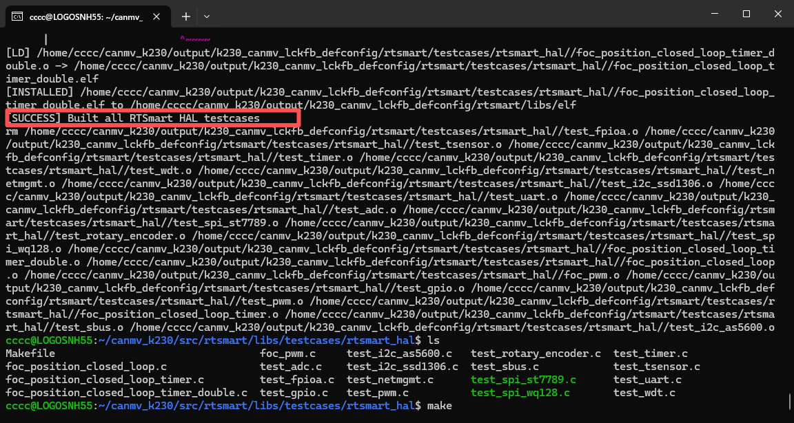
   
   如果输出`[SUCCESS] Built all RTSmart HAL testcases`就说明代码没有错误编译成功，输出文件夹在
   
   `canmv_k230/output/k230_canmv_lckfb_defconfig/rtsmart/libs/elf`
   
   将对应文件拷到内存卡，用TTL转USB模块连接K230的串口3，使用终端调试工具调试。
   
   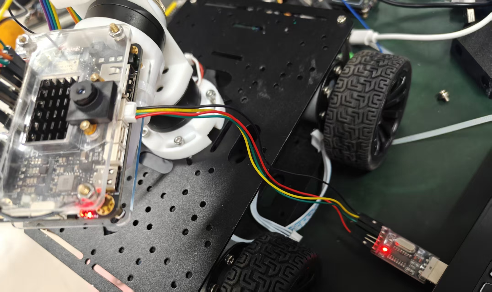
   
   如果使用官方的CanMV镜像，初始化完成会默认执行micropython，输入Ctrl+C 退出程序，然后回车，进入到放置elf的位置，执行elf。
   
   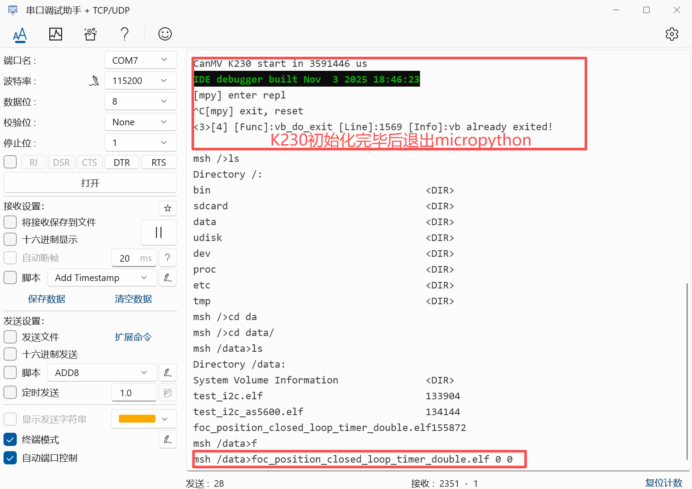
6. **封装到micropython**
   
   测试完成可以用后我们就可以移植到micropython，先在`/canmv_k230/src/canmv/port`新建一个我们库的文件夹。
   
   在创建一个.c文件，然后可以直接把我们的代码复制过去。
   
   封装前要先引用一下两个头文件`#include"py/obj.h"`和`#include"py/runtime.h"`
   
   编写初始化函数，micropython的函数都要以`mp_obj_t`为返回值，如果没有返回则`return mp_const_none;`
   ```c_cpp
   STATIC mp_obj_t DFOC_Init(void)
   {
       AS5600_Init(&AS5600_i2c_1, IIC1_SCL, 34, IIC1_SDA, 35, 4000000);
       AS5600_Init(&AS5600_i2c_2, IIC0_SCL, 48, IIC0_SDA, 49, 4000000);
       ...
       ...
       Timer_Init(0, &timer);
       mp_printf(&mp_plat_print, "FOC Module Initialized\n");
   
       return mp_const_none;
   }
   STATIC MP_DEFINE_CONST_FUN_OBJ_0(mp_DFOC_Init_obj, DFOC_Init);
   ```
   
   编写控制函数，这些都大同小异
   ```c_cpp
   STATIC mp_obj_t DFOC_Set_Motor_Angle(mp_obj_t angle_obj_1, mp_obj_t angle_obj_2)
   {
       pid1.setpoint = mp_obj_get_float(angle_obj_1);
       pid2.setpoint = mp_obj_get_float(angle_obj_2);
       return mp_const_none;
   }
   STATIC MP_DEFINE_CONST_FUN_OBJ_2(mp_DFOC_Set_Motor_Angle_obj, DFOC_Set_Motor_Angle);
   ```
   
   编写完函数后要用`MP_DEFINE_CONST_FUN_OBJ_*`注册一下该函数在micropython中的函数对象。
注册对象要根据函数的形参使用相应的宏，
   
   类似的宏有
   ```
   MP_DEFINE_CONST_FUN_OBJ_0(obj_name, fun_name)
   MP_DEFINE_CONST_FUN_OBJ_1(obj_name, fun_name)
   MP_DEFINE_CONST_FUN_OBJ_2(obj_name, fun_name)
   MP_DEFINE_CONST_FUN_OBJ_3(obj_name, fun_name)
   MP_DEFINE_CONST_FUN_OBJ_VAR(obj_name, n_args_min, fun_name)
   MP_DEFINE_CONST_FUN_OBJ_VAR_BETWEEN(obj_name, n_args_min, n_args_max, fun_name)
   MP_DEFINE_CONST_FUN_OBJ_KW(obj_name, n_args_min, fun_name)
   ```
   
   下面是大于四个形参的写法
   ```c_cpp
   STATIC mp_obj_t DFOC_Set_PID(size_t n_args, const mp_obj_t *args)
   {
       mp_obj_t Kp_obj = args[0];
       mp_obj_t Ki_obj = args[1];
       mp_obj_t Kd_obj = args[2];
       mp_obj_t num = args[3];
       if(mp_obj_get_int(num) == 1)
       {
           pid1.Kp = mp_obj_get_float(Kp_obj);
           pid1.Ki = mp_obj_get_float(Ki_obj);
           pid1.Kd = mp_obj_get_float(Kd_obj);
       }
       else if(mp_obj_get_int(num) == 2)
       {
           pid2.Kp = mp_obj_get_float(Kp_obj);
           pid2.Ki = mp_obj_get_float(Ki_obj);
           pid2.Kd = mp_obj_get_float(Kd_obj);
       }
       return mp_const_none;
   }
   STATIC MP_DEFINE_CONST_FUN_OBJ_VAR(mp_DFOC_Set_PID_obj, 4, DFOC_Set_PID);
   ```
   
   编写完函数后，我们要把刚刚注册的对象放到`mp_rom_map_elem_t`类型的数组中，这个数组用于存储MicroPython模块该库的全局符号表。就是存了这个模块的名字，和所有函数名。
   ```c_cpp
   STATIC const mp_rom_map_elem_t dfoc_module_globals_table[] = {
       { MP_ROM_QSTR(MP_QSTR___name__), MP_ROM_QSTR(MP_QSTR_dfoc) },//这个dfoc就是我们未来在写micropython要调用的库名
       { MP_ROM_QSTR(MP_QSTR_DFOC_Init), MP_ROM_PTR(&mp_DFOC_Init_obj) },//DFOC_Init就是在micropython要使用的初始化函数名
       { MP_ROM_QSTR(MP_QSTR_DFOC_Set_Motor_Angle), MP_ROM_PTR(&mp_DFOC_Set_Motor_Angle_obj) },
       { MP_ROM_QSTR(MP_QSTR_DFOC_Set_Motor_Angle_1), MP_ROM_PTR(&mp_DFOC_Set_Motor_Angle_1_obj) },
       { MP_ROM_QSTR(MP_QSTR_DFOC_Set_Motor_Angle_2), MP_ROM_PTR(&mp_DFOC_Set_Motor_Angle_2_obj) },
       { MP_ROM_QSTR(MP_QSTR_DFOC_AS5600_GetAngle), MP_ROM_PTR(&mp_DFOC_AS5600_GetAngle_obj) },
       { MP_ROM_QSTR(MP_QSTR_DFOC_Set_PID), MP_ROM_PTR(&mp_DFOC_Set_PID_obj) },
   };
   ```
   
   最后将这个表注册到micropython中，注册类型是module。
   
   这一段写好基本不用改，后面增删函数只用修改上面的表。
   ```c_cpp
   STATIC MP_DEFINE_CONST_DICT(dfoc_globals_table, dfoc_module_globals_table);
   
   const mp_obj_module_t dfoc_module = {
       .base = { &mp_type_module },
       .globals = (mp_obj_dict_t *)&dfoc_globals_table,
   };
   MP_REGISTER_MODULE(MP_QSTR_dfoc, dfoc_module);
   ```
7. **编译micropython**
   
   在`/canmv_k230/src/canmv/port`的Makefile文件内添加一行，将我们新增的文件夹添加进编译，然后在上一级`/canmv`目录`make`一下。
   
   在确保代码没问题的情况下，如果编译不了，清空一下编译缓存，再全局编译一下就可以了。
   
   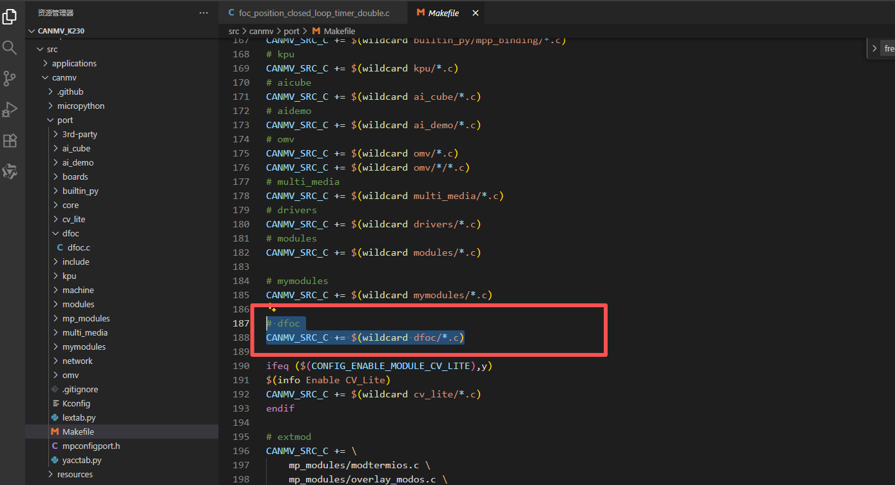
   
   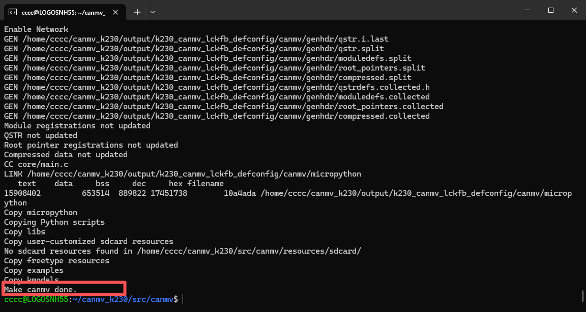
   
   如上输出代表编译成功。
   
   会在`canmv_k230/output/k230_canmv_lckfb_defconfig/canmv`输出一个`micropython`文件，把它替换掉SD卡内原先的`micropython`文件，可以使用DiskGenius这款软件。
   
   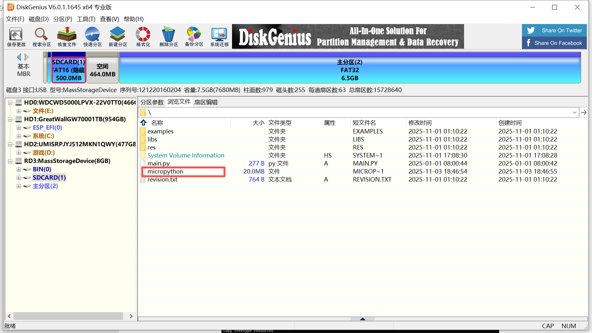
8. **测试micropython**
   
   将K230连接到CanMV IDE，试下我们刚刚封装的代码，顺便测试一下PID的值
   ```python
   import time
   import dfoc
   import math
   
   dfoc.DFOC_Init()
   def DFOC_Set_Motor_1(angle1):
       #40 ~ 130限位，防止把线扯断了
       if(angle1 > 130):
           angle1 = 130
       elif(angle1 < 40):
           angle1 = 40
       angle1 = -angle1#这一步变换和云台的安装位置对应，我这里取-90°云台Y轴正好对着中间，所以取个负
       radians1 = math.radians(angle1)#角度转弧度
       dfoc.DFOC_Set_Motor_Angle_1(radians1)
   
   def DFOC_Set_Motor_2(angle2):
       #50 ~ 150
       if(angle2 > 150):
           angle2 = 150
       elif(angle2 < 50):
           angle2 = 50
       angle2 = angle2 - 90
       radians2 = math.radians(angle2)
       dfoc.DFOC_Set_Motor_Angle_2(radians2)
   
   dfoc.DFOC_Set_PID(0.15, 0, 2.0, 1)
   dfoc.DFOC_Set_PID(0.7, 0, 3.0, 2)
   
   DFOC_Set_Motor_1(90)
   DFOC_Set_Motor_2(90)
   
   while True:
       pass
   ```
   
   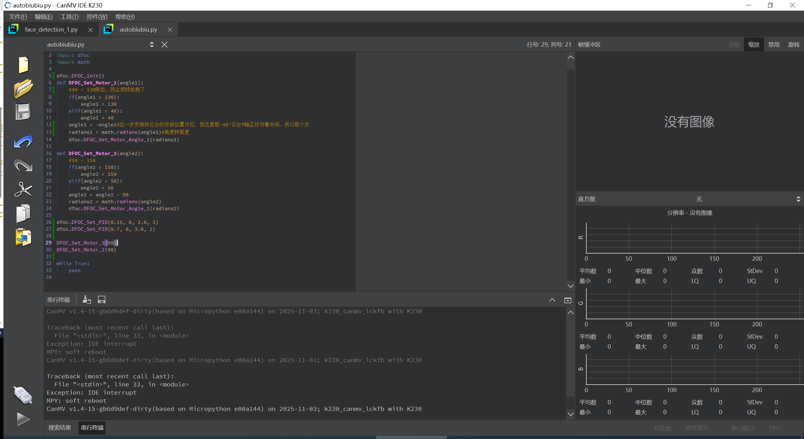
   
   位置环效果
   
   
   
   <br/>
9. **配合官方AI库实现物体自动跟踪**
   
   配合官方人脸检测例程，写一个物体自动跟踪，只需要加个PID，建议加上积分限幅。
   ```python
   from libs.PipeLine import PipeLine
   from libs.AIBase import AIBase
   from libs.AI2D import Ai2d
   from libs.Utils import *
   import os,sys,ujson,gc,math
   from media.media import *
   import nncase_runtime as nn
   import ulab.numpy as np
   import image
   import aidemo
   import dfoc
   
   def DFOC_Set_Motor_1(angle1):
       #40 ~ 130
       if(angle1 > 130):
           angle1 = 130
       elif(angle1 < 40):
           angle1 = 40
       angle1 = -angle1
       radians1 = math.radians(angle1)
       dfoc.DFOC_Set_Motor_Angle_1(radians1)
   
   def DFOC_Set_Motor_2(angle2):
       #50 ~ 150
       if(angle2 > 150):
           angle2 = 150
       elif(angle2 < 50):
           angle2 = 50
       angle2 = angle2 - 90
       radians2 = math.radians(angle2)
       dfoc.DFOC_Set_Motor_Angle_2(radians2)
   
   class PID:
       def __init__(self, kp, ki, kd, setpoint, integral_limit):
           # 比例系数
           self.kp = kp
           # 积分系数
           self.ki = ki
           # 微分系数
           self.kd = kd
           # 设定值
           self.setpoint = setpoint
           # 积分项
           self.integral = 0
           # 上一次的误差
           self.last_error = 0
           # 积分限幅的上限和下限，格式为 (min, max)
           self.integral_limit = integral_limit
   
       def update(self, current_value):
           # 计算当前误差
           error = self.setpoint - current_value
   
           # 计算积分项
           self.integral += error
           # 积分限幅
           min_limit, max_limit = self.integral_limit
           if self.integral > max_limit:
               self.integral = max_limit
           elif self.integral < min_limit:
               self.integral = min_limit
   
           # 计算微分项
           derivative = error - self.last_error
   
           # 计算PID输出
           output = self.kp * error + self.ki * self.integral + self.kd * derivative
   
           # 更新上一次的误差
           self.last_error = error
   
           return output
   
   pid1 = PID(kp=0.015, ki=0.001, kd=0.006, setpoint=0, integral_limit=(-10, 10))
   pid2 = PID(kp=0.015, ki=0.001, kd=0.006, setpoint=0, integral_limit=(-10, 10))
   motor_x = 90
   motor_y = 90
   def move(x, y):
       global motor_x
       global motor_y
       temp1 = pid1.update(x)
       temp2 = pid2.update(y)
       motor_x = motor_x - temp1
       motor_y = motor_y - temp2
       DFOC_Set_Motor_1(motor_y)
       DFOC_Set_Motor_2(motor_x)
   
   
   # 自定义人脸检测类，继承自AIBase基类
   class FaceDetectionApp(AIBase):
       def __init__(self, kmodel_path, model_input_size, anchors, confidence_threshold=0.5, nms_threshold=0.2, rgb888p_size=[224,224], display_size=[1920,1080], debug_mode=0):
           super().__init__(kmodel_path, model_input_size, rgb888p_size, debug_mode)  # 调用基类的构造函数
           self.kmodel_path = kmodel_path  # 模型文件路径
           self.model_input_size = model_input_size  # 模型输入分辨率
           self.confidence_threshold = confidence_threshold  # 置信度阈值
           self.nms_threshold = nms_threshold  # NMS（非极大值抑制）阈值
           self.anchors = anchors  # 锚点数据，用于目标检测
           self.rgb888p_size = [ALIGN_UP(rgb888p_size[0], 16), rgb888p_size[1]]  # sensor给到AI的图像分辨率，并对宽度进行16的对齐
           self.display_size = [ALIGN_UP(display_size[0], 16), display_size[1]]  # 显示分辨率，并对宽度进行16的对齐
           self.debug_mode = debug_mode  # 是否开启调试模式
           self.ai2d = Ai2d(debug_mode)  # 实例化Ai2d，用于实现模型预处理
           self.ai2d.set_ai2d_dtype(nn.ai2d_format.NCHW_FMT, nn.ai2d_format.NCHW_FMT, np.uint8, np.uint8)  # 设置Ai2d的输入输出格式和类型
   
       # 配置预处理操作，这里使用了pad和resize，Ai2d支持crop/shift/pad/resize/affine，具体代码请打开/sdcard/app/libs/AI2D.py查看
       def config_preprocess(self, input_image_size=None):
           with ScopedTiming("set preprocess config", self.debug_mode > 0):  # 计时器，如果debug_mode大于0则开启
               ai2d_input_size = input_image_size if input_image_size else self.rgb888p_size  # 初始化ai2d预处理配置，默认为sensor给到AI的尺寸，可以通过设置input_image_size自行修改输入尺寸
               top, bottom, left, right,_ =letterbox_pad_param(self.rgb888p_size,self.model_input_size)
               self.ai2d.pad([0, 0, 0, 0, top, bottom, left, right], 0, [104, 117, 123])  # 填充边缘
               self.ai2d.resize(nn.interp_method.tf_bilinear, nn.interp_mode.half_pixel)  # 缩放图像
               self.ai2d.build([1,3,ai2d_input_size[1],ai2d_input_size[0]],[1,3,self.model_input_size[1],self.model_input_size[0]])  # 构建预处理流程
   
       # 自定义当前任务的后处理，results是模型输出array列表，这里使用了aidemo库的face_det_post_process接口
       def postprocess(self, results):
           with ScopedTiming("postprocess", self.debug_mode > 0):
               post_ret = aidemo.face_det_post_process(self.confidence_threshold, self.nms_threshold, self.model_input_size[1], self.anchors, self.rgb888p_size, results)
               if len(post_ret) == 0:
                   return post_ret
               else:
                   return post_ret[0]
   
       # 绘制检测结果到画面上
       def draw_result(self, pl, dets):
           with ScopedTiming("display_draw", self.debug_mode > 0):
               if dets:
                   pl.osd_img.clear()  # 清除OSD图像
                   for det in dets:
                       # 将检测框的坐标转换为显示分辨率下的坐标
                       x, y, w, h = map(lambda x: int(round(x, 0)), det[:4])
                       xm = x + w/2 - 1280/2
                       ym = y + h/2 - 720/2
                       x = x * self.display_size[0] // self.rgb888p_size[0]
                       y = y * self.display_size[1] // self.rgb888p_size[1]
                       w = w * self.display_size[0] // self.rgb888p_size[0]
                       h = h * self.display_size[1] // self.rgb888p_size[1]
                       pl.osd_img.draw_rectangle(x, y, w, h, color=(255, 255, 0, 255), thickness=2)  # 绘制矩形框
   
                       pl.osd_img.draw_cross(int(1280/2 * self.display_size[0] // self.rgb888p_size[0]), int(720/2 * self.display_size[1] // self.rgb888p_size[1]), color=(255, 255, 0, 255), size=10, thickness=3)
                       move(xm, ym)
   
               else:
                   pl.osd_img.clear()
   
   
   if __name__ == "__main__":
       dfoc.DFOC_Init()
       dfoc.DFOC_Set_PID(0.15, 0, 1.8, 1)
       dfoc.DFOC_Set_PID(0.15, 0, 1.8, 2)
       DFOC_Set_Motor_1(90)
       DFOC_Set_Motor_2(90)
       time.sleep(2)
       # 添加显示模式，默认hdmi，可选hdmi/lcd/lt9611/st7701/hx8399/nt35516,其中hdmi默认置为lt9611，分辨率1920*1080；lcd默认置为st7701，分辨率800*480
       display_mode="hdmi"
       # k230保持不变，k230d可调整为[640,360]
       rgb888p_size = [1280, 720]
       # 设置模型路径和其他参数
       kmodel_path = "/sdcard/examples/kmodel/face_detection_320.kmodel"
       # 其它参数
       confidence_threshold = 0.5
       nms_threshold = 0.2
       anchor_len = 4200
       det_dim = 4
       anchors_path = "/sdcard/examples/utils/prior_data_320.bin"
       anchors = np.fromfile(anchors_path, dtype=np.float)
       anchors = anchors.reshape((anchor_len, det_dim))
   
       # 初始化PipeLine，用于图像处理流程
       pl = PipeLine(rgb888p_size=rgb888p_size, display_mode=display_mode)
       pl.create()  # 创建PipeLine实例
   
       display_size=pl.get_display_size()
       # 初始化自定义人脸检测实例
       face_det = FaceDetectionApp(kmodel_path, model_input_size=[320, 320], anchors=anchors, confidence_threshold=confidence_threshold, nms_threshold=nms_threshold, rgb888p_size=rgb888p_size, display_size=display_size, debug_mode=0)
       face_det.config_preprocess()  # 配置预处理
       while True:
           with ScopedTiming("total",1):
               img = pl.get_frame()            # 获取当前帧数据
               res = face_det.run(img)         # 推理当前帧
               face_det.draw_result(pl, res)   # 绘制结果
               pl.show_image()                 # 显示结果
               gc.collect()                    # 垃圾回收
       face_det.deinit()                       # 反初始化
       pl.destroy()                            # 销毁PipeLine实例
   
   
   ```

**快速定位效果**

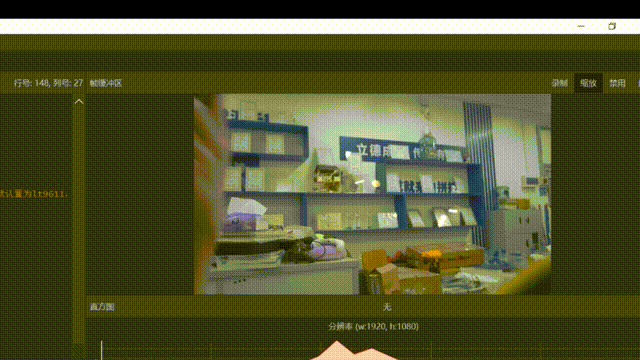

# 开源代码

[https://github.com/Death6sentence/FOC_Lib_for_K230micropython](https://)

# 结语

很高兴能参加本次的RT-Thread嵌入式大赛，由于最近刚好有多个项目开发比较仓促，作品做的比较简陋，目前效果觉得大体上令人满意就发出来了。但是在开发过程中也是越发觉得K230这个板子比较“骚气”，感觉双核架构还可以研究出很多有意思玩法，基于Linux的一些网络协议栈，应该能让K230更方便的做一些物联网开发。目前K230的CanMV官方镜像是只有大核跑RT-Smart，笔者也是比较希望官方能给个像以前一样，小核也能跑Linux的CanMV镜像，这样可以方便开发在micropython上的一些网络协议，这样就可以让K230访问一些网络API。

这个FOC库（包括硬件设计）笔者正在逐步完善中，如果有更多的人一起丰富K230的生态，未来应该会有很多有意思的库。